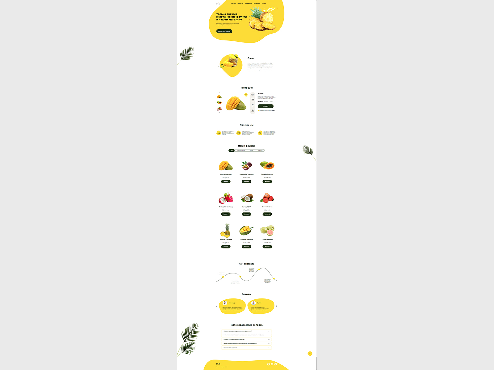

# Лендинг для магазина экзотических фруктов

Самостоятельно выполненный проект в рамках обучения на курсе "Профессия Frontend-Разработчик" в онлайн-школе "Айтилогия".

## Внешний вид **[(открыть демо)](https://batnd.github.io/landing-fruit-shop/)**

## Выполненные задачи:
- Вёрстка адаптивной веб-страницы по макету;
- Практика адаптивной верстки (от 320px);
- Практика применения CSS-стилей, CSS-псевдоклассов, CSS Flexbox;
- Практика использования препроцессора SASS (SCSS);
- Практика использования JavaScript для реализации функционала (обработка событий, валидация форм, изменение структуры DOM-элементов);
- Практика применения библиотек JavaScript (jQueryUI, jQueryInputMask, Slick, Animate.css, wow.js).

## Используемые технологии:
* HTML
* CSS (SCSS)
* JavaScript
* jQuery
* jQueryUI
* Gulp
