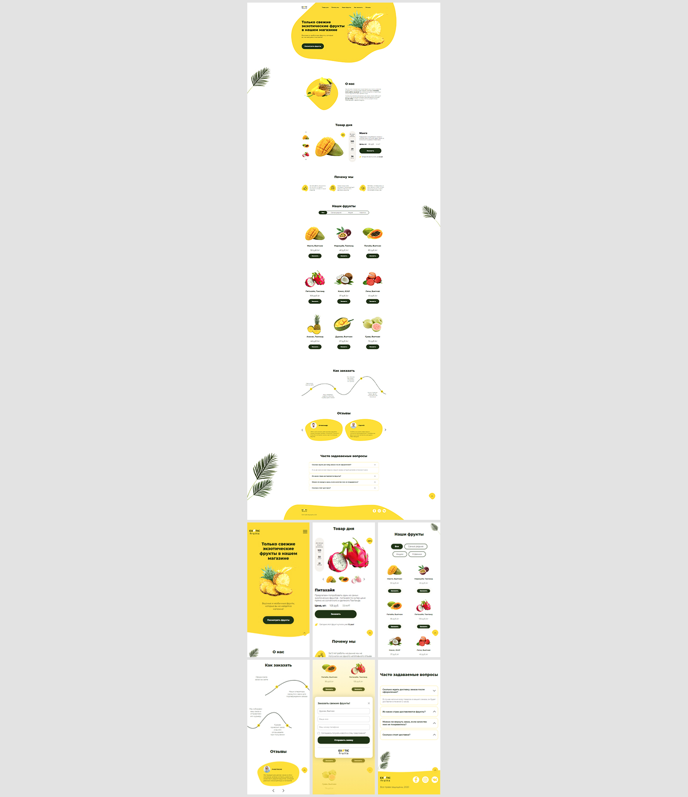

# Лендинг для магазина с экзотическими фруктами

Вёрстка и реализация функционала лендинга для магазина экзотических фруктов  
**Год:** 2022

## Внешний вид **[(открыть демо)](https://batnd.github.io/landing-fruit-shop/)**

## Реализовано:
- Вёрстка адаптивной веб-страницы по макету;
- Адаптив (от 320px);
- Стилизация лендинга с использованием препроцессора SASS (SCSS);
- Реализация функционала (слайдеры, каталог товаров, таймеры акций, отправка и валидация форм);
- Применение анимаций для улучшения пользовательского опыта.

## Используемые технологии:
* HTML
* CSS (SCSS)
* JavaScript
* jQuery
* jQueryUI
* Gulp
